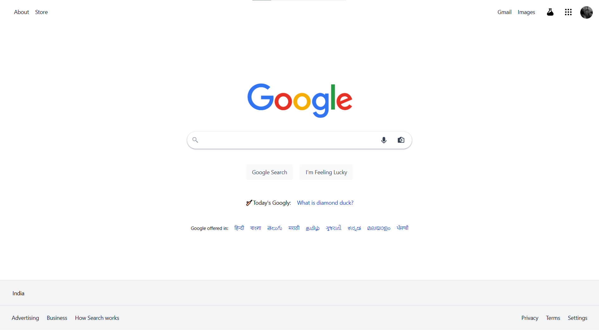

# Google UI Clone 🌐

This is a **basic clone of the Google homepage UI** made using **HTML** and **Tailwind CSS**. It replicates the static layout and design of Google's homepage — primarily for practice and learning purposes.

## 📸 Preview



## 🔍 What's Included

- Google-like header with links and profile image
- Search bar with icons
- Buttons: "Google Search" & "I'm Feeling Lucky"
- Country name and footer links
- Static layout using Tailwind CSS

## ⚠️ Limitations

- **Search bar and buttons are non-functional**
- **Navigation links don’t work** (static placeholders only)
- UI is **partially responsive** — may not look perfect on all screen sizes

## 🛠️ Technologies Used

- HTML5
- Tailwind CSS
- Basic CSS utilities
- SVG icons and images

## 📁 Folder Structure

<pre>
Google-UI-Clone/
├── src/
│   ├── index.html
│   ├── input.css
│   ├── output.css
│   └── Images/
│       ├── google.png
│       ├── profile.jpg
│       └── screenshot.png
└── README.md
</pre>

## 🚀 How to View Locally

1. Download or clone this repository
2. Go to the `src` folder
3. Open `index.html` in any modern browser

> 💡 If you're editing styles, make sure to recompile Tailwind CSS using the command below.

## 🔧 Tailwind Build Command (if using CLI)

```bash
npx tailwindcss -i ./src/input.css -o ./src/output.css --watch
```

## ✍️ Author

**GULAM MOHYUDIN MEMON**
Feel free to connect or suggest improvements.

---

💬 This project was built for learning and UI practice. Feel free to fork or improve it!
